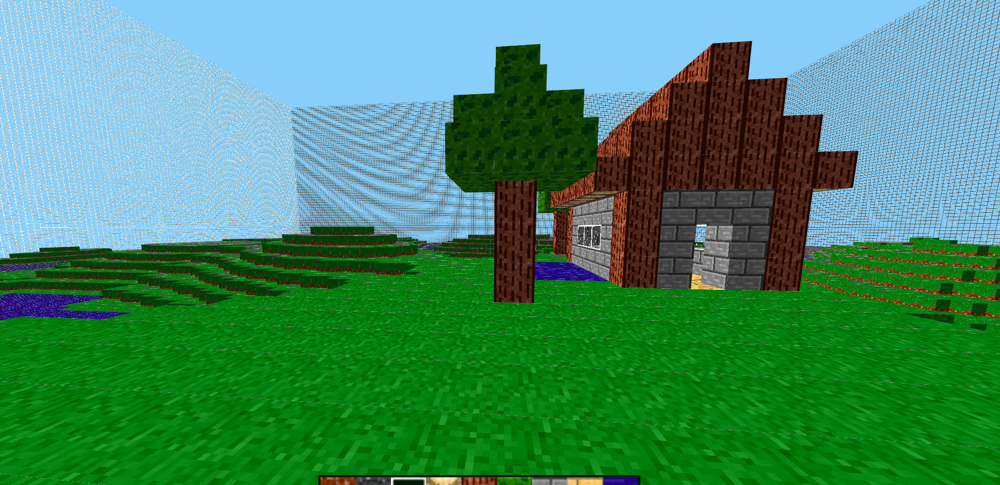
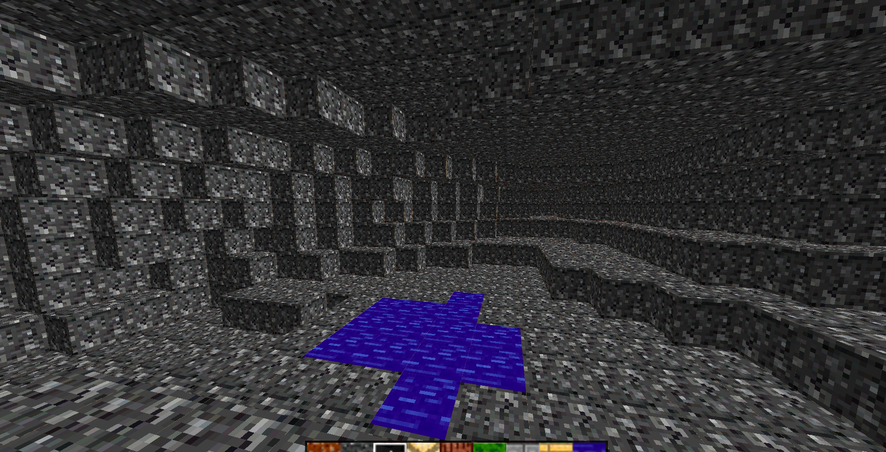

# WebCraft

Simple minecraft clone made using javascript + webgl.
I didn't updated the project for a long time, excep for refactoring it in order to use webpack, so this is pretty much abandoned.

Currently it support the next features:

- 2d perlin noise for world generation.
- Cave generation by using 3d perlin noise.
- Player physics with the blocks.
- Block placement and removing.
- Simple block physics for water and sand (much like old minecraft classic).

| Building support by using various blocks | Cave generation |
| - | - |
|| |

Controls:

- Hold left mouse button clicked to move the camera by moving the mouse.
- Right click on a block to push a new block on next to it.
- Left click on a block to remove it.
- Use WASD for moving.
- Jump with space.
- Press N to enable noclip.
- Press F to disable noclip.

## Play remotely

Recently I've posted the game in https://jo65.itch.io/webcraft so it can be played without downloading.

## Run locally

This project have been built using webpack, so in order to run the game locally you must first clone this repository and once cloned, run the following commands in the project folder (assuming you have npm installed):

```{bash}
npm i
npm run build
```

Once you have built it you will need a static server running so the browser can load the files, if you have http-server you can use the next command:

```{bash}
npm run up
```

And then you will be able to play in your browser by going to http://localhost:8080.